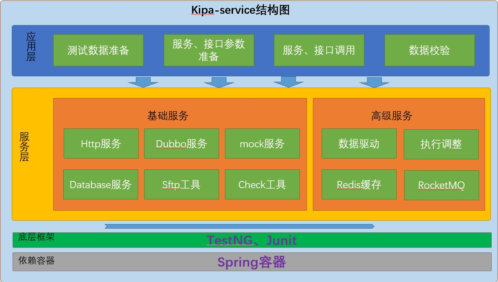

> # Kipa测试框架的总体介绍
>
> 背景：实际的分布式项目测试会涉及http接口、dubbo接口的调用，同时消息、缓存也是我们测试的校验项，本测试框架提供了http接口调用、dubbo接口调用、数据库增删改查、http请求的mock、sftp文件的上传和下载、RocketMQ消息的发送和消费以及redis缓存的基本操作，能够满足分布式系统测试的基本要求，对于测试人员来说，可以极大的减少对于测试代码本身的时间消耗，更多关注业务本身；进而提高测试效率，提升测试质量。
>
> > 基本结构
>
> 

[代码的目录结构](wiki/structure.md)
# 详细使用

## 一. 依赖配置

### 1. 依赖

```xml
    <dependency>
        <groupId>com.kipa</groupId>
        <artifactId>kipa-service</artifactId>
        <version>${lastest-version}</version>
    </dependency>
```

### 2. 配置

**(1) 基本配置**

A.  直接继承BasicTestNGSpringContextTests基类，默认会读取application.properties框架数据配置文件启动整个kipa-service框架，如果没有该文件，框架会启动失败。

B . 需要在application.properties配置框架加载的基本配置信息：数据源配置、http基本配置、dubbo基本配置、sftp基本配置等等，项目启动回去加载这些配置，初始化对应的服务或者工具。

C. 需要在项目的resources下面config目录中新建配置文件：business.properties，方便我们将自定义配置的常用信息、目标项目的配置信息等等放到该文件中，

```properties
 # 业务的数据配置信息
 shopping.web.base.url=http://127.0.0.1:1234/hello/console
```

```java
//可以通过Spring @Value注解进行获取，并初始化
 @Value("${shopping.web.base.url}")
 private String baseUrl;
```

D. 需要在resources下面新建data目录，用于放数据驱动的数据文件，当然这个不是必选项，不会影响框架的整体启动，但是推荐这样做。

**(2) 自定义配置（高级配置，支持Redis、RocketMQ）**

A. 继承框架提供的BaseSpringIntegrationConfiguration配置类：他是Spring的基于@Configuration注解的配置类。
B. 继承框架提供的 BaseTestNGSpringContextTests基类，它是spring整合TestNG的入口类，通过@ContextConfiguration 注解去加载Spring的配置类，从而运行整个测试框架

C. 选择配置Redis，在Spring配置类（eg: DemoSpringIntegrationConfiguration）中添加@EnableRedis注解开启redis，RedisModel默认是集群模式的redis，可以自定义配置STAND_ALONE（单机模式的）redis

D:选择配置RocketMq,在在Spring配置类（eg: DemoSpringIntegrationConfiguration添加@EnableRocketMQ开启rocketMq的配置，需要配置扫描消息消费监听的路径listenerScanPackage，扫描带有@RocketMQListener注解的类，将其加入消费监听容器中

E. 选择配置多数据，在在Spring配置类（eg: DemoSpringIntegrationConfiguration）配置类中开启@EnableMultipleDataSource(env = {EnvFlag.ENV1, EnvFlag.ENV2, EnvFlag.ENV3, EnvFlag.ENV4})同时最多可以开启5个数据源。

F. 配置业务的数据文件：通过Spring提供的@PropertySource注解进行配置

> 整合配置如下：
>
> ```java
> /*
>  * <p>自定义配置的样例，切记这仅仅是样例，需要根据自己的项目需要进行配置</>
>  * <p>所有配置的总配置类：http、dubbo、mock、mybatis、redis、mq</p>
>  * <p>切勿直接继承!!!!! </p>
>  */
>
> //1. 开启特定的测试环境- 测试
> @EnableEnvironmentSwitch(env = EnvironmentType.TEST)
> //2. 默认开启集群的redis操作，若要开启集群的请添加RedisModel.CLUSTER注解
> @EnableRedis(model = RedisModel.STAND_ALONE)
> //3. 开启RocketMQ的配置
> @EnableRocketMQ(listenerScanPackage = "com.kipa.service")
> //4. 开启多数据源
> @EnableMultipleDataSource(env = {EnvFlag.ENV1, EnvFlag.ENV2, EnvFlag.ENV3, EnvFlag.ENV4})
> //5. 默认的业务数据文件，通过Spring提供的原生的 @PropertySource 注解
> @PropertySource("classpath:config/business.properties")
> public class DemoSpringIntegrationConfiguration extends BaseSpringIntegrationConfiguration{
> }
> ```
>
> ```java
> /* 
>  * <p>框架高级用法整合样例，切勿直接继承该类</p>
>  * <p>切勿直接继承!!!!! </p>
>  */
> @ContextConfiguration(classes = DemoSpringIntegrationConfiguration.class)
> public class DemoTestNGSpringContextTests extends BaseTestNGSpringContextTests {
> }
> ```

整个的配置情况如下图：

[配置文件详解](wiki/config.md)
## 二、 使用示例

### 1. 基本使用

```java
/**
* 直接继承框架提供的测试基类
*/
public class HelloTest extends BaseTestNGSpringContextTests {

    @Test
    public void hello() {
        System.out.println("hello kipa test");
    }
}
```
```java
/**
* 继承框架自定义测试的基类
*/
public class HelloTest extends BaseTestContextApplication {

    @Test
    public void hello() {
        System.out.println("hello kipa test");
    }
}
```

### 2. Http使用

关于http的操作，框架提供了http和https两种类型的的操作，如果需要使用https需要在http.properties的配置文件中配置相关的安全证书信息

http提供了httpService和HttpsService两个服务类，可以帮助我们发起http请求，目前支持get、post、put、delete、以及文件的上传和下载等功能，能够满足测试需要，支持同步调用和异步调用，如下是同步调用的样例：

```java
public class HttpTest extends BaseTestNGSpringContextTests {

 	//注入http服务
    @Autowired
    private HttpService httpService;

  	/**
  	* get请求直接传url进行调用，返回的结果是一个json或者其他报文格式
  	*/
    @Test
    public void testGet() {
        String s = httpService.get("http://localhost:8989/user/findById?id=1");
        System.out.println(s);
    }

   /**
  	* post请求直接传url进行调用，接口请求是json格式的，返回的结果是一个json或者其他报文格式
  	*/
    @Test
    public void testPost() {
        Map<String, String> paramMap = Maps.newHashMap();
        paramMap.put("username","spring");
        paramMap.put("password","123456");
        paramMap.put("password2","123456");
        paramMap.put("email","spring@123.com");
        paramMap.put("phone","123456789");
        String json = JSON.toJSONString(paramMap);
        String result = httpService.post("http://localhost:8989/user/save", json);
        System.out.println(result);
    }

    	@Test
        public void testPut() {
            Map<String, String> headMap = Maps.newHashMap();
            headMap.put("Accept","application/json");
            Map<String, String> paramMap = Maps.newHashMap();
            paramMap.put("id","104");
            paramMap.put("username","root");
            paramMap.put("password","456123");
            paramMap.put("password2","456123");
            paramMap.put("email","root@123.com");
            paramMap.put("phone","4747474747");
            String jsonString = JSON.toJSONString(paramMap);
            String result = httpService.put("http://localhost:8989/user/update", headMap, jsonString, true);
            System.out.println(result);
        }

        @Test
        public void testDelete() {
            Map<String, String> paramMap = Maps.newHashMap();
            paramMap.put("ids","104,91,92,93");
            String result = httpService.delete("http://localhost:8989/user/delete", paramMap, true);
            System.out.println(result);
        }

```
[http使用的详细wiki](wiki/http.md)

### 3. Dubbo使用

dubbo接口调用需要传的参数有：接口名称（接口全路径、方法名称、参数类型名称全路径与参数值），如果dubbo接口是没有参数的，参数名称全路径和参数值不用传，否则会报错或者找不到服务提供者。dubbo调用有三种方式：同步调用、异步调用、直连调用。样例如下：

```java
public class DubboTest extends BaseTestNGSpringContextTests {

    @Autowired
    DubboService dubboService;
  	//同步调用，dubbo接口是基础数据参数
    @Test
    public void testSyncParam() {
        Map<String, Object> paramMap = Maps.newHashMap();
        paramMap.put(String.class.getName(),"16323232223");
        String result = dubboService.invoke("com.learn.springboot.springbootssmp.dubbo.UserInfoDubboService", "queryUserInfoByPhoneNo", paramMap);
        System.out.println(result);
    }

  	//同步调用，dubbo接口是一个包装的对象，转成JSONObject
    @Test
    public void testSyncObject() {
        String json = "{\"phone\":\"16323232223\",\"email\":\"jordan@huawei.com\"}";
        Map<String, Object> paramMap = Maps.newHashMap();
        paramMap.put("com.learn.springboot.springbootssmp.ro.UserRo", JSONObject.parseObject(json));
        String result = dubboService.invoke("com.learn.springboot.springbootssmp.dubbo.UserInfoDubboService", "getInfo", paramMap);
        System.out.println(result);
    }
}
```
[dubbo使用的详细wiki](wiki/dubbo.md)

### 4. Mock使用
框架提供的mock功能只支持mock http请求，需要传入http请求的相关信息和http响应的相关信息，会在本地分配出来一个端口mock服务，默认是6231。当然，端口可以自己在mockserver.properties进行配置。

```java
public class MockTest extends BaseTestNGSpringContextTests {

    @Autowired
    private MockService mockService;

  	/**
  	* 通过文件构造mock请求和响应对象，框架提供了CSVutils工具类，可以构造对象
  	* @BeforeMethod 这个注解是为了在@Test方法之前运行mock操作，方便在@Test方法里面http调用的时候
  	* 返回mock的结果
  	*/
        @BeforeMethod
        public void before() {
            MockParamRequest request =CSVUtils.convert2Bean(MockParamRequest.class,"mock/data/mockParamRequest.csv",0,CSVType.VERTICAL);
            MockResponse response = CSVUtils.convert2Bean(MockResponse.class,"mock/data/mockResponse.csv",0,CSVType.VERTICAL);
            //通过mock服务进行mock操作
            mockService.mockResponse(request, response);
        }

    @Autowired
    private HttpService httpService;

    @Test
    public void testMock() {
       	//http 调用，返回结果是mock的结果
        String s = httpService.get("http:127.0.0.1:1234/userInfo/showUserInfo?phone=2355464646, true);
        System.out.println(s);
    }

```
[mock使用的详细wiki](wiki/mock.md)

### 5. Sftp使用

项目中常常存在生成话单或者账单文件等业务进行数据传递或者业务交互，框架提供了SftpHelper工具用于文件的上传、下载到sftp服务器。 常用的操作有：文件的长传、下载、删除、是否存在等操作。

```java
public class SftpTest  extends BaseTestNGSpringContextTests {

    @Test
    public void testUpload() {
        String localFilePath = "C:\\workspace\\Project\\testTools\\execute\\src\\test\\resources\\service\\data\\test\\Test.csv";
        SftpHelper.upload(localFilePath, "/opt/data/sftp/test/","Test.csv");
    }
}

```

### 6.DB(mybatis)使用

框架对于数据库的操作，封装了mybatis的一些简单的CRUD操作，传入参数或者sql语句就可以实现和数据库的交互。

##### 基本的增删改查操作

```java
public class DatabaseTest  extends BaseTestNGSpringContextTests {

  		//直接注入DatabaseService服务进行数据库增删改查的操作
        @Autowired
        DatabaseService databaseService;

        @Test
        public void test1() {
            Map<String, Object> map = databaseService.selectOne("select * from tb_user where username = 'kobe' and id = 1");
            System.out.println(map);
        }

        @Test
        public void test4() {
            Map<String,Object> map = Maps.newHashMap();
            map.put("password",123456);
            map.put("phone","141414141");
            List<Map<String, Object>> list = databaseService.selectList("tb_user", map);
            System.out.println(list);
        }

    	/**
  	* 分页查询多条数据，将多个查询条件拼成sql语句进行交互
  	* 将结果封装成List<Map<String, Object>>
  	*/
        @Test
        public void test10() {
            Map<String,Object> map = Maps.newHashMap();
            map.put("password",123456);
            map.put("phone","141414141");
            List<Map<String, Object>> list = databaseService.selectPage("tb_user", map, 1, 2);
            System.out.println(list);
        }


  	/**
  	* 插入数据，将数据添加到map中进行数据插入
  	* 返回结果 插入成功返回1，插入失败返回0
  	*/
        @Test
        public void test12() {
            Map<String, Object> map = Maps.newLinkedHashMap();
            map.put("username","mybatis");
            map.put("password","123456");
            map.put("phone","1234567890");
            map.put("email","mybatis@123.com");
            map.put("created",new Date());
            map.put("updated",new Date());
            int result = databaseService.insert("tb_user", map);
            System.out.println(result);
        }

    	/**
  	* 删除数据，将数据添加到map中进行数据插入
  	* 返回结果 插入成功返回1，插入失败返回0
  	*/
        @Test
        public void test19() {
            int result = databaseService.delete("tb_user", Arrays.asList("username = 'oracle7'"));
            System.out.println(result);
        }
}
```
[数据库使用的详细wiki](wiki/mybatis.md)

### 7. 结果校验

框架提供了CheckHelper这个工具类帮助我们进行结果校验，提供了实体类、集合、数组、map，还有大对象的校验，checkBeanEquals对普通Javabean以及基础数据类型校验；checkEntityEquals是服实体类进行校验，实体类具备的特征就是没有大字段，同时提供了私有属性的get和set方法。具体示例如下：

#### 校验普通基础数据类型，包括list、map、数组

```java
public class CheckTest extends BaseTestNGSpringContextTests {

    	List<Map<String, Object>> list = Lists.newArrayList();
        Map<String, Object> map = Maps.newHashMap();
        map.put("username","kobe");
        map.put("phone","123456789");
        Map<String, Object> map3 = Maps.newHashMap();
        map3.put("username","kobe2");
        map3.put("phone","123456789");
        list.add(map);
        list.add(map3);
        List<Map<String, Object>> list1 = Lists.newArrayList();
        Map<String, Object> map1 = Maps.newHashMap();
        map1.put("username","kobe1");
        map1.put("phone","123456789");
        Map<String, Object> map4 = Maps.newHashMap();
        map4.put("username","kobe");
        map4.put("phone","123456789");
        list1.add(map1);
        list1.add(map4);
  		//校验 两个map对象是否相等
        CheckHelper.checkBeanEquals(map, map1, "map不相等");
  		//校验 两个list集合是否相等
        CheckHelper.checkBeanEquals(list, list1, "list不相等");
=======================================================================
Exception in thread "main" java.lang.KipaProcessException: list不相等:
当前集合第1个元素字段对应的
实际值为：[username <==> kobe]，期望值为：[username <==> kobe1]
当前集合第2个元素字段对应的
实际值为：[username <==> kobe2]、期望值为：[username <==> kobe]
```
[对象校验使用的详细wiki](wiki/check.md)

## 三、高级使用
其他数据驱动、RocketMq、Redis、多数据源切换，多环境切换的使用如下：
[高级配置使用的详细wiki](wiki/advance.md)


## 四、测试框架相关的
实际的测试过程中，我们往往会碰到测试用例需要依赖其他的用例执行之后生成数据，把数据传递给下一条测试用例，或者一个测试用例中间每一个测试步骤需要参数传递，框架整合了Ehcache缓存框架，并提供了GlobalCacheContext。

框架定义了@TestCase注解，为了标识测试用例，以及批量执行时候的顺序；定义了@Step注解，为了标识一个测试类里面的每一个测试步骤执行的先后顺序。

[测试框架相关的详细信息wiki](wiki/framework.md)
