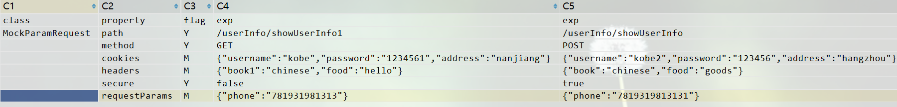

## 三、高级使用

### 1. 数据处理

#### （一）csv文件进行数据处理

#####  (1) 将csv转化为对象

csv文件的格式被设计为三种，分别对应三种不同的枚举

```
/**
 * 水平行模式的csv文件，也就是行模式csv
 */
TRANSVERSE("T"),
/**
 * 竖直列模式的csv文件， 也就是列模式csv
 */
VERTICAL("V"),
/**
 * 竖直列模式的数据库校验csv文件，也就是字段带有下划线， 列模式的csv
 */
CHECK_DB("C");
```

csv文件信息, 其中class代表该类的类名，property代表该类的属性字段，flag代表转化的标识、exp代表对应的属性值。

其中flag字段又分为4种

Y--会去拼成字段；

N--不会拼成字段；

M--json格式为对象json（Map式）， 格式如：{"username":"kobe","password":"123456"}；

L--json的格式为列表json（List式），格式如：[{"username":"kobe","password":"123456"},{"username":"kobe","password":"123456"}]

```csv
//对象json样例，文件名：mockParamRequest.csv
"class","property","flag","exp"
"MockParamRequest","path","Y","/userInfo/showUserInfo"
"","method","Y",GET
"","cookies",N,""
"","headers",N,""
"","secure","Y",""
"","requestParams",M,{"phone":"16323232223"}
```

对应的实体类信息：

```java
@AllArgsConstructor
@NoArgsConstructor
@Data
public class MockParamRequest {
    private String path;
    private String method;
    private Map<String, String> cookies ;
    private Map<String, String> headers ;
    private boolean secure;
    private Map<String, String> requestParams;
}
```
csv数据文件

行模式的csv文件

列模式的csv文件


```java
//1.创建一个csv文件
//创建列模式csv
CSVUtils.createCsvFile(MockParamRequest.class, "mock/data/MockParamRequest_1.csv", CSVType.VERTICAL);
//创建行模式csv
CSVUtils.createCsvFile(MockResponse.class,"mock/data/MockResponse_1.csv",CSVType.TRANSVERSE);
//创建带下划线的csv
CSVUtils.createCsvFile(MockResponse.class,"mock/data/MockResponse_2.csv",CSVType.CHECK_DB);
============================================================================================
  //2. csv转化
/**
* 转化为一个对象
*/
MockResponse response1 = CSVUtils.convert2Bean(MockResponse.class, "mock/data/mockResponse_3.csv", 0, CSVType.VERTICAL);
/**
* 转化为对象list
*/
List<MockParamRequest> mockParamRequests = CSVUtils.convert2BeanList( MockParamRequest.class, "mock/data/mockParamRequest.csv", CSVType.VERTICAL);
```

```csv
//列表json样例 文件名：mockResponse.csv
"class","property","flag","exp"
"MockResponse","cookies",N,""
"","headers",N,""
"","body",L,"[{""id"":1, ""username"":""kobe"",""phone"":""16323232223"",""created"":""1234-09-14""}]"
"","reasonPhrase",N,""
"","statusCode","Y",200
"","delay",N,""
```

解析csv文件将数据封装成Map<String, Object>、List<Map<String, Object>> 进行其他操作。

```java
//解析csv生成list
List<Map<String, Object>> mapList = CSVUtils.parseCsvFile("data/head.csv", CSVType.VERTICAL);
//解析csv生成map
Map<String, Object> map = CSVUtils.parseCsvFile("data/head.csv", 1, CSVType.VERTICAL);
```

#### (二) 基于testng的数据驱动

##### （1）testng提供的dataprovider进行数据驱动

默认csv数据文件的路径是当前测试类的类名+方法.csv, csv文件如下：

```j
url,path,name,value
http://127.0.0.1:6231,/userInfo/showUserInfo,phone,16323232223
```

```java
public class CsvDataTest extends BaseTestConfiguration{

    @Autowired
    private HttpService httpService;
	//数据驱动的名称为csv， csv文件的读取路径为：CsvDataTest.testMock.csv
    @Test(dataProvider = "csv")
    public void testMock(String url,String path,String name, String value) {
        String s = httpService.get(String.format("%s%s?%s=%s",url, path, name, value), true);
        System.out.println(s);
    }
}

```

（2）自定义数据参数的文件路径

框架提供了注解@DataMeta和@DataParam, 当标识有@MockHttp注解的方法需要进行数据驱动的时候，单一的参数可以直接通过@DataParam注入数据，多参数的方法需要通过@DataMeta进行数据驱动，具体用法如下：

```java
public class DataHelloTest extends BaseTestConfiguration {

    @Autowired
    private MockService mockService;

    @Autowired
    private HttpService httpService;

    //用MockHttp标识的方法会在@Test注解标识的方法之前运行，达到mock的作用
    @MockHttp
    @DataMeta({
            @DataParam(paramName = "requestCsvFile",paramValue = "mock/data/mockParamRequest.csv"),
            @DataParam(paramName = "responseCsvFile",paramValue = "mock/data/mockResponse.csv")
    })
    public void mock(String requestCsvFile, String responseCsvFile) {
        MockParamRequest request = CSVUtils.convert2Bean(MockParamRequest.class,requestCsvFile, 1, CSVType.VERTICAL);
        MockResponse response = CSVUtils.convert2Bean(MockResponse.class, responseCsvFile,1,CSVType.VERTICAL);
        mockService.mockResponse(request, response);
    }

    @Test(dataProvider = "csv")
    public void test(String url,String path,String name, String value) {
        System.out.println("=================测试=================");
        String s = httpService.get(String.format("%s%s?%s=%s",url, path, name, value), true);
        System.out.println(s);
    }
}
```

### 2. 环境的切换

在实际的测试过程中，我们可能会有多套环境，比如开发环境（dev）、测试环境（qa），预生产环境（preqa）,生产环境，框架提供了@AppConfigScan用于扫描配置注解@Database、@Dubbo、@Http。

其中：

@Database注解是数据源配置注解，用于数据源的切换

@Dubbo注解是用于dubbo接口调用的消费端的配置

@Http注解是用于http和https等安全证书的环境切换配置

配置在总的框架的总配置类上面， 具体配置情况如下：

```java
@Configuration
//导入基本的http、dubbo、mock、mybatis的spring配置文件
@Import(BaseConfiguration.class)
//包扫描：扫描带有@Database、@Dubbo、@Http的注解从而动态的切换spring配置
@AppConfigScan("com.kipa.service")
public class DemoApplicationConfiguration {

}

/*
 * 这三个注解推荐配置到测试的入口类上面，需要修改的时候直接修改入口配置类，这样会方便很多
 * 框架高级用法整合样例，切勿直接继承该类
 */
@Database(datasourceFlag = "dev")
@Http(httpFlag = "dev")
@Dubbo(configFlag = "dev",version = "1.0.0",timeout = 120000)
@Listeners({DataMetaAnnotationListener.class})
@ContextConfiguration(classes = DemoApplicationConfiguration.class)
public class DemoTestContextConfiguration extends AbstractTestNGSpringContextTests {

    @DataProvider(name = "csv")
    public Iterator<Object[]> providerData(Method method) {
        CSVDataProvider csvDataProvider = new CSVDataProvider();
        return csvDataProvider.providerData(method);
    }
}

```

### 3. RocketMQ的使用

分布式系统的测试过程中，，往往需要发消息或者消费消息来实现业务的异步调用或者服务的解耦，需要测试人员进行接收消息的操作，框架通过整合RocketMQ提供了发送消息的服务以及消费消息的入口，帮助更简单的测试。

### （一）配置

#### （1）配置主配置类

```java
@Configuration
@Import(BaseConfiguration.class)
//添加@EnableRocketMQ注解，开启RocketMQ，listenerScanPackage必须要填写，标识扫描对应路径下面
//所有的带@RocketMQListener注解的类，并开启消费监听
@EnableRocketMQ(listenerScanPackage = "service.mq")
public class ApplicationConfiguration {

}
```

#### （2）配置数据文件

```properties
#rocketMq的生产者的配置
rocketmq.producer.groupName=kipa
#mq的nameserver地址
rocketmq.producer.nameServerAddress=127.0.0.1:9876

#rocketMq的消费者的配置
rocketmq.consumer.groupName=kipa
#mq的nameserver地址
rocketmq.consumer.nameServerAddress=127.0.0.1:9876
```

### （二）使用方式

#### （1）消息生产者

框架提供了MQProducerService消息生产服务发送消息，会根据topic、tag等配置进行消息发送，可以满足基本的发送要求

```java
public class ProducerTest extends BaseTestContextApplication {
    @Autowired
    private MQProducerService mqProducerService;

    @Test
    public void test() {
        for (int i = 0; i < 100; i++) {
            mqProducerService.send("hello rocketMq, this is hello world===>"+i,"TestTopic","TagA");
        }
    }

}
```

#### （2）消息消费者

框架提供了@RocketMQListener注解来标识消息的消费监听器，当容器启动后会扫描所有的@RocketMQListener注解标识的类，启动对应的监听，同时放到容器中，进行消息的消费。

框架会解析@Subscribe注解标识的方法，将消费的消息转化为messageType类型参数值，注入到对应的方法结果中，我们可以直接在方法中进行我们的业务测试工作，不用额外的关心消息消费的其他细节

```java
@RocketMQListener(topic = "TestTopic",consumePosition = ConsumeFromWhere.CONSUME_FROM_FIRST_OFFSET)
public class ConsumerService {

    @Subscribe(tag = "TagA",messageType = String.class)
    public void test1(String message) {
        System.out.println("=============="+message+"===============");
    }

    @Subscribe(tag = "TagA",messageType =MessageExt.class)
    public void test2(MessageExt message) {
        System.out.println("====="+message.getMsgId()+"========="+new String(message.getBody(), StandardCharsets.UTF_8)+"===============");
    }

}
```

### 4. Redis的使用

项目在请求频繁或者常用数据的一些业务中会做数据缓存，往往需要测试去验证缓存中的数据正确性或者有效性，框架整合了spring data redis，提供了RedisTemplate和StringRedisTemplate进行缓存的处理。

### （一）配置

#### （1）配置主配置类

```java
@Configuration
@Import(BaseConfiguration.class)
//添加开启@EnableRedis注解，开启redis的配置,RedisModel如果是STAND_ALONE代表单机版的redis
//RedisModel如果是CLUSTER代表集群版的redis,默认是集群版的redis
@EnableRedis(model = RedisModel.STAND_ALONE)
public class ApplicationConfiguration {

}
```

#### （2）配置数据文件

```properties
#redis
#redis cluster（集群）地址
spring.redis.cluster.address=192.168.3.21:36379,192.168.3.22:36379,192.168.3.23:36379
# redis 集群密码
spring.redis.cluster.password=123456

# redis单机地址
spring.redis.standalone.address=192.168.3.22:98613
#redis 单机密码
spring.redis.standalone.password=123456
```

####  （3）使用

直接注入RedisTemplate或者StringRedisTemplate进行redis的数据操作

```java
public class RedisTest extends BaseTestContextApplication {

    @Autowired
    private RedisTemplate redisTemplate;

    @Autowired
    private StringRedisTemplate stringRedisTemplate;

    @Test
    public void test() {
        System.out.println(redisTemplate.opsForHash().get("hello","123456"));
        System.out.println(stringRedisTemplate.opsForValue().get("hello"));
    }
}
```
