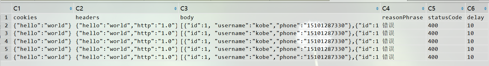

## 三、高级使用

### 1. 数据处理

#### （一）csv文件进行数据处理

#####  (1) 将csv转化为对象

csv文件的格式被设计为三种，分别对应三种不同的枚举

```
/**
 * 水平行模式的csv文件，也就是行模式csv
 */
TRANSVERSE("T"),
/**
 * 竖直列模式的csv文件， 也就是列模式csv
 */
VERTICAL("V"),
/**
 * 竖直列模式的数据库校验csv文件，也就是字段带有下划线， 列模式的csv
 */
CHECK_DB("C");
```

csv文件信息, 其中class代表该类的类名，property代表该类的属性字段，flag代表转化的标识、exp代表对应的属性值。

其中flag字段又分为4种

Y--会去拼成字段；

N--不会拼成字段；

M--json格式为对象json（Map式）， 格式如：{"username":"kobe","password":"123456"}；

L--json的格式为列表json（List式），格式如：[{"username":"kobe","password":"123456"},{"username":"kobe","password":"123456"}]

```csv
//对象json样例，文件名：mockParamRequest.csv
"class","property","flag","exp"
"MockParamRequest","path","Y","/userInfo/showUserInfo"
"","method","Y",GET
"","cookies",N,""
"","headers",N,""
"","secure","Y",""
"","requestParams",M,{"phone":"16323232223"}
```

对应的实体类信息：

```java
@AllArgsConstructor
@NoArgsConstructor
@Data
public class MockParamRequest {
    private String path;
    private String method;
    private Map<String, String> cookies ;
    private Map<String, String> headers ;
    private boolean secure;
    private Map<String, String> requestParams;
}
```
csv数据文件

行模式的csv文件

列模式的csv文件


```java
//1.创建一个csv文件
//创建列模式csv
CSVUtils.createCsvFile(MockParamRequest.class, "mock/data/MockParamRequest_1.csv", CSVType.VERTICAL);
//创建行模式csv
CSVUtils.createCsvFile(MockResponse.class,"mock/data/MockResponse_1.csv",CSVType.TRANSVERSE);
//创建带下划线的csv
CSVUtils.createCsvFile(MockResponse.class,"mock/data/MockResponse_2.csv",CSVType.CHECK_DB);
============================================================================================
  //2. csv转化
/**
* 转化为一个对象
*/
MockResponse response1 = CSVUtils.convert2Bean(MockResponse.class, "mock/data/mockResponse_3.csv", 0, CSVType.VERTICAL);
/**
* 转化为对象list
*/
List<MockParamRequest> mockParamRequests = CSVUtils.convert2BeanList( MockParamRequest.class, "mock/data/mockParamRequest.csv", CSVType.VERTICAL);
```

```csv
//列表json样例 文件名：mockResponse.csv
"class","property","flag","exp"
"MockResponse","cookies",N,""
"","headers",N,""
"","body",L,"[{""id"":1, ""username"":""kobe"",""phone"":""16323232223"",""created"":""1234-09-14""}]"
"","reasonPhrase",N,""
"","statusCode","Y",200
"","delay",N,""
```

解析csv文件将数据封装成Map<String, Object>、List<Map<String, Object>> 进行其他操作。

```java
//解析csv生成list
List<Map<String, Object>> mapList = CSVUtils.parseCsvFile("data/head.csv", CSVType.VERTICAL);
//解析csv生成map
Map<String, Object> map = CSVUtils.parseCsvFile("data/head.csv", 1, CSVType.VERTICAL);
```

#### (二) 基于testng的数据驱动

##### （1）testng提供的dataprovider进行数据驱动

默认csv数据文件的路径是当前测试类的类名+方法.csv, csv文件如下：

```j
url,path,name,value
http://127.0.0.1:6231,/userInfo/showUserInfo,phone,16323232223
```

```java
public class CsvDataTest extends BasicTestNGSpringContextTests{

    @Autowired
    private HttpService httpService;
	//数据驱动的名称为csv， csv文件的读取路径为：CsvDataTest.testMock.csv
    @Test(dataProvider = "csv")
    public void testMock(String url,String path,String name, String value) {
        String s = httpService.get(String.format("%s%s?%s=%s",url, path, name, value), true);
        System.out.println(s);
    }
}

```

（2）自定义数据参数的文件路径

框架提供了注解@DataMeta和@DataParam, 当标识有@MockHttp注解的方法需要进行数据驱动的时候，单一的参数可以直接通过@DataParam注入数据，多参数的方法需要通过@DataMeta进行数据驱动，具体用法如下：

```java
public class DataHelloTest extends BasicTestNGSpringContextTests {

    @Autowired
    private MockService mockService;

    @Autowired
    private HttpService httpService;

    //用MockHttp标识的方法会在@Test注解标识的方法之前运行，达到mock的作用
    @MockHttp
    @DataMeta({
            @DataParam(paramName = "requestCsvFile",paramValue = "mock/data/mockParamRequest.csv"),
            @DataParam(paramName = "responseCsvFile",paramValue = "mock/data/mockResponse.csv")
    })
    public void mock(String requestCsvFile, String responseCsvFile) {
        MockParamRequest request = CSVUtils.convert2Bean(MockParamRequest.class,requestCsvFile, 1, CSVType.VERTICAL);
        MockResponse response = CSVUtils.convert2Bean(MockResponse.class, responseCsvFile,1,CSVType.VERTICAL);
        mockService.mockResponse(request, response);
    }

    @Test(dataProvider = "csv")
    public void test(String url,String path,String name, String value) {
        System.out.println("=================测试=================");
        String s = httpService.get(String.format("%s%s?%s=%s",url, path, name, value), true);
        System.out.println(s);
    }
}
```

### 2. 环境的切换

在实际的测试过程中，我们可能会有多套环境，比如开发环境（dev）、测试环境（qa），预生产环境（preqa）,生产环境：框架提供了 @EnableEnvironmentSwitch 注解进行环境切换，根据不同的环境切换不同的配置文件。

eg: 如果是TEST环境，那么框架会自动读取resources目录下面的application-test.properties文件，并初始化配置。

配置在总的框架的总配置类上面， 具体配置情况如下：

```java
@AllArgsConstructor
@Getter
public enum EnvironmentType {

    /**
     * 默认的环境
     */
    DEFAULT("def"),
    /**
     * 测试环境
     */
    TEST("test"),

    /**
     * 开发环境
     */
    DEVELOPMENT("dev"),

    /**
     * 预生产
     */
    PRE_PRODUCT("pre"),

    /**
     * 生产
     */
    PRODUCT("prod");

    private String remark;

}

//1. 开启特定的测试环境- 测试
@EnableEnvironmentSwitch(env = EnvironmentType.TEST)
//2. 默认开启集群的redis操作，若要开启集群的请添加RedisModel.CLUSTER注解
public class DemoSpringIntegrationConfiguration extends BaseSpringIntegrationConfiguration{

}
```

### 3. RocketMQ的使用

分布式系统的测试过程中，，往往需要发消息或者消费消息来实现业务的异步调用或者服务的解耦，需要测试人员进行接收消息的操作，框架通过整合RocketMQ提供了发送消息的服务以及消费消息的入口，帮助更简单的测试。

### （一）配置

#### （1）配置主配置类

```java
//3. 开启RocketMQ的配置
@EnableRocketMQ(listenerScanPackage = "com.kipa.service")
public class DemoSpringIntegrationConfiguration extends BaseSpringIntegrationConfiguration{

}

@ContextConfiguration(classes = DemoSpringIntegrationConfiguration.class)
public class DemoTestNGSpringContextTests extends BaseTestNGSpringContextTests {

}
```

#### （2）配置数据文件

```properties
#rocketMq的生产者的配置
rocketmq.producer.groupName=kipa
#mq的nameserver地址
rocketmq.producer.nameServerAddress=127.0.0.1:9876

#rocketMq的消费者的配置
rocketmq.consumer.groupName=kipa
#mq的nameserver地址
rocketmq.consumer.nameServerAddress=127.0.0.1:9876
```

### （二）使用方式

#### （1）消息生产者

框架提供了MQProducerService消息生产服务发送消息，会根据topic、tag等配置进行消息发送，可以满足基本的发送要求

```java
public class ProducerTest extends BaseTestContextApplication {
    @Autowired
    private MQProducerService mqProducerService;

    @Test
    public void test() {
        for (int i = 0; i < 100; i++) {
            mqProducerService.send("hello rocketMq, this is hello world===>"+i,"TestTopic","TagA");
        }
    }

}
```

#### （2）消息消费者

框架提供了@RocketMQListener注解来标识消息的消费监听器，当容器启动后会扫描所有的@RocketMQListener注解标识的类，启动对应的监听，同时放到容器中，进行消息的消费。

框架会解析@Subscribe注解标识的方法，将消费的消息转化为messageType类型参数值，注入到对应的方法结果中，我们可以直接在方法中进行我们的业务测试工作，不用额外的关心消息消费的其他细节

```java
@RocketMQListener(topic = "TestTopic",consumePosition = ConsumeFromWhere.CONSUME_FROM_FIRST_OFFSET)
public class ConsumerService {

    @Subscribe(tag = "TagA",messageType = String.class)
    public void test1(String message) {
        System.out.println("=============="+message+"===============");
    }

    @Subscribe(tag = "TagA",messageType =MessageExt.class)
    public void test2(MessageExt message) {
        System.out.println("====="+message.getMsgId()+"========="+new String(message.getBody(), StandardCharsets.UTF_8)+"===============");
    }

}
```

### 4. Redis的使用

项目在请求频繁或者常用数据的一些业务中会做数据缓存，往往需要测试去验证缓存中的数据正确性或者有效性，框架整合了spring data redis，提供了RedisTemplate和StringRedisTemplate进行缓存的处理。

### （一）配置

#### （1）配置主配置类

```java
//2. 默认开启集群的redis操作，若要开启集群的请添加RedisModel.CLUSTER注解
@EnableRedis(model = RedisModel.STAND_ALONE)
public class DemoSpringIntegrationConfiguration extends BaseSpringIntegrationConfiguration{
}

@ContextConfiguration(classes = DemoSpringIntegrationConfiguration.class)
public class DemoTestNGSpringContextTests extends BaseTestNGSpringContextTests {
}
```

#### （2）配置数据文件

```properties
#redis
#redis cluster（集群）地址
spring.redis.cluster.address=192.168.3.21:36379,192.168.3.22:36379,192.168.3.23:36379
# redis 集群密码
spring.redis.cluster.password=123456

# redis单机地址
spring.redis.standalone.address=192.168.3.22:98613
#redis 单机密码
spring.redis.standalone.password=123456
```

####  （3）使用

直接注入RedisTemplate或者StringRedisTemplate进行redis的数据操作

```java
public class RedisTest extends BaseTestContextApplication {

    @Autowired
    private RedisTemplate redisTemplate;

    @Autowired
    private StringRedisTemplate stringRedisTemplate;

    @Test
    public void test() {
        System.out.println(redisTemplate.opsForHash().get("hello","123456"));
        System.out.println(stringRedisTemplate.opsForValue().get("hello"));
    }
}
```

### 5. 多数据源并行

测试时，有时候会碰到需要操作不同服务器上的数据源，框架除了提供DatabaseService数据库默认的操作之外，还提供了4个并行操作数据库的服务，分别为DatabaseService1， DatabaseService2， DatabaseService3， DatabaseService4，对应4个环境标识的数据源：env1，env2，env3，env4，具体的用法如下：

#### （1）配置

在框架整合的入口类BaseTestContextApplication上面标注@EnableMultipleDataSource注解，同时配置需要开启的环境的标识，EnvFlag.ENV1 表示开启数据源标识为env1配置的数据源，如果有多个会同时开启多个。

```java
//4. 开启多数据源
@EnableMultipleDataSource(env = {EnvFlag.ENV1, EnvFlag.ENV2, EnvFlag.ENV3, EnvFlag.ENV4})
public class DemoSpringIntegrationConfiguration extends BaseSpringIntegrationConfiguration{

}

@ContextConfiguration(classes = DemoSpringIntegrationConfiguration.class)
public class DemoTestNGSpringContextTests extends BaseTestNGSpringContextTests {
}
```

框架会去读取db.properties文件中带env1，env2，env3，env4四个标识的数据源配置信息并初始化数据源操作的信息。

```properties
# 数据源env1
env1.mybatis.datasource.driver=com.mysql.cj.jdbc.Driver
env1.mybatis.datasource.url=jdbc:mysql://localhost:3306/mybatisplus?useUnicode=true&characterEncoding=UTF-8&allowMultiQueries=true&useSSL=false&useUnicode=true&useJDBCCompliantTimezoneShift=true&useLegacyDatetimeCode=false&serverTimezone=UTC
env1.mybatis.datasource.username=root
env1.mybatis.datasource.password=123456
# 数据源env2
env2.mybatis.datasource.driver=com.mysql.cj.jdbc.Driver
env2.mybatis.datasource.url=jdbc:mysql://localhost:3306/51shopping?useUnicode=true&characterEncoding=UTF-8&allowMultiQueries=true&useSSL=false&useUnicode=true&useJDBCCompliantTimezoneShift=true&useLegacyDatetimeCode=false&serverTimezone=UTC
env2.mybatis.datasource.username=root
env2.mybatis.datasource.password=123456
# 数据源env3
env3.mybatis.datasource.driver=com.mysql.cj.jdbc.Driver
env3.mybatis.datasource.url=jdbc:mysql://localhost:3306/mybatisplus?useUnicode=true&characterEncoding=UTF-8&allowMultiQueries=true&useSSL=false&useUnicode=true&useJDBCCompliantTimezoneShift=true&useLegacyDatetimeCode=false&serverTimezone=UTC
env3.mybatis.datasource.username=root
env3.mybatis.datasource.password=123456
# 数据源env4
env4.mybatis.datasource.driver=com.mysql.cj.jdbc.Driver
env4.mybatis.datasource.url=jdbc:mysql://localhost:3306/51shopping?useUnicode=true&characterEncoding=UTF-8&allowMultiQueries=true&useSSL=false&useUnicode=true&useJDBCCompliantTimezoneShift=true&useLegacyDatetimeCode=false&serverTimezone=UTC
env4.mybatis.datasource.username=root
env4.mybatis.datasource.password=123456
```

#### （2）使用

和DatabaseService使用方式一样，需要注入DatabaseService1、DatabaseService2、DatabaseService3、

DatabaseService4 进行数据crud操作。

```java
public class MultipleDatasourceTest extends TestContextConfiguration {

    @Autowired
    private DatabaseService databaseService;

    @Autowired
    private DatabaseService1 databaseService1;

    @Autowired
    private DatabaseService2 databaseService2;

    @Autowired
    private DatabaseService3 databaseService3;

    @Autowired
    private DatabaseService4 databaseService4;

    @Test
    public void test() {
        //test
        Map<String, Object> map = databaseService.selectOne("select * from tb_user where id = 1");
        PrintUtils.println(map);

        //mybatis plus
        Map<String, Object> map1 = databaseService1.selectOne("select * from user where id = 1");
        PrintUtils.println(map1);

        //51shopping
        Map<String, Object> map2 = databaseService2.selectOne("select * from tb_user where id = 1");
        PrintUtils.println(map2);

        //mybatis plus
        Map<String, Object> map3 = databaseService3.selectOne("select * from user where id = 1");
        PrintUtils.println(map3);

        //51shopping
        Map<String, Object> map4 = databaseService4.selectOne("select * from tb_user where id = 1");
        PrintUtils.println(map4);
    }
```

### 6. 参数List，Map的构建

框架中有很多方法的参数都是list或者map，如果参数很多，数据量很大，推荐使用csv数据文件进行数据驱动，框架提供的CSVUtils工具类可以帮我们转化成对用的list、map；如果参数不是特别多，但是传统的new list或者new map的方式会感觉有很多冗余的编写，基于此框架提供了ParamList和ParamMap的参数构建器，帮助我们减少冗余的代码。具体示例如下：

```java

	//1. 构建list，默认创建的是一个ArrayList，把数据add到里面去
    @Test
    public void testBuildList() {
        List<String> list = ParamList.<String>newList().add("ok").add("yes").add("hello").add("good").build();
        System.out.println(list);
    }

    //2. 构建list，自己创建一个ArrayList，把数据add到里面去
    @Test
    public void testBuildList2() {
        List<String> list = ParamList.newList(new ArrayList<String>()).add("ok").add("yes").add("hello").add("good").build();
        System.out.println(list);
    }

	//3. 构建map, 默认创建一个ConcurrentHashMap，根据参数的类型可以确定泛型，将需要添加的值put进去
    @Test
    public void testBuildMap() {
        Map<String, Object> paramMap = ParamMap.<String, Object>newMap()
                .put("username", "mybatis")
                .put("phone", "1234567890")
                .put("phone","891379183131")
                .put("email","mybatis@123.com")
                .put("createDate",new Date())
                .put("updateDate",new Date())
                .build();
        System.out.println(paramMap);
    }

	//4. 构建map, 创建map的时候可以传入想要传入map的类型，根据参数的类型可以确定泛型， 将需要添加的值put进去
	@Test
    public void testBuildMap1() {
        Map<String, Object> paramMap = ParamMap.newMap(new HashMap<String, Object>())
                .put("username", "mybatis")
                .put("phone", "1234567890")
                .put("phone","891379183131")
                .put("email","mybatis@123.com")
                .put("createDate",new Date())
                .put("updateDate",new Date())
                .build();
        System.out.println(paramMap);
    }
```

当然像Arrays.asList()这样的Java提供的一些工具类也可以帮我们简化多参数的代码冗余繁琐的问题，需要灵活运用。

### 7.测试用例编写以及规范

#### 1. 从业务角度分析测试用例

（1）对于测试人员来说，业务分为多个测试的模块。每个模块有对应不同的流程、业务场景：

​	比如：米庄的开户业务，分为借款人开户、投资人开户会调用不同的接口、涉及不同的流程；所以建议不同		的业务场景写一条用例，也就是对于开户业务来说，我们可以写投资人开户用例、借款人开户用例两条测试用例。

（2）每条用例建议都映射成一个TestCase，kipa-service提供了@TestCase注解用来标识为一个测试用例，同时规定测试用例执行的顺序。

#### 2. 测试用例的分解

（1）对于一条测试用例来说，它又分为若干个小的步骤，每个步骤可能会调一个接口：

​	比如：米庄的投资人开户分为5个步骤，登录、请求开户、执行开户，校验开户信息、请求懒猫开户。

（2）每个步骤会调用一个接口，那么我们需要对每一个步骤进行参数准备、接口调用、结果校验，确保每个测试的步骤没有问题，才能确保整个测试用例的流程没有问题。

（3）每个测试步骤之前可能有前后的顺序和依赖关系，testng本身的@Test注解里面的属性priority可以帮助我们运行整个测试类的时候确保运行的优先级（先后顺序），dependsOnMethods属性可以让我们强依赖某个测试的步骤。

（4）另外，kipa-service也提供了@Step整个注解。如果标识了step注解的测试步骤，通过order属性确定了步骤执行的先后顺序，运行的时候也会按照既定的顺序执行

#### 3. 测试用例的编写

（1）共有的一些数据、变量

kipa-service框架整个了ehcache缓存框架，可以将application.properties属性文件中以common开头的key以及value都放到全局缓存里面，使用的时候，，只需要注入GlobalCacheContext，根据key获取对应的属性值来使用。

（2）每个测试用例的可能会涉及参数传递，可以直接放到GlobalCacheContext全局缓存中，下个用例直接获取

（3）步骤之间的数据传递，testng已经提供了测试的上下文，只需要在测试的时候，注入ITestContext接口，进行保存和获取

（4）每个测试用例映射为一个测试类，每个测试步骤隐射为一个@Test的测试方法

#### 4. 注意事项

（1）测试用例的命名

建议：测试用例以业务流程的含义命名，比如：投资人开户：LenderOpenAccountTest.java

（2）测试步骤的命名

建议：调用的接口的含义命名：比如请求开户：

```java
@Test
public void requestLenderOpenAccount() {
}
```


### 8. 框架批量拉起执行器

传统的TestNG的测试用例需要将测试用例配到testng.xml的配置文件中，运行该文件可以批量的执行，目前这种方式会加大我们的工作量，每写一条用例就需要配置一条，加大了工作量。框架基于自定义注解+包扫描的方式进行了测试用例的执行，同时定制了TestNG的执行器(TestNGExecutor)，可以帮我们进行批量执行并生产测试报告。

也可以自定义执行器，通过TestNGLaunchCondition 和实现TestNGLauncher接口进行自定义。

```java
    @Test
    public void test() {
        TestNGDiscovery discovery = TestNGDiscovery.builder()
                .selectPackage("com.qinyadong.service.test.run")
                .filterClass(Arrays.asList(RunTest.class))
                .build();
        TestNGExecutor executor = new TestNGExecutor();
        executor.execute(discovery);
    }
```

```java
public class CustomizeTestNGExecutor {

    public void execute(TestNGDiscovery discovery) {
        TestNGLaunchCondition<BasicTestNGSpringContextTests> condition = new TestNGLaunchCondition<>();
        condition.setBaseClass(BasicTestNGSpringContextTests.class);
        condition.setFilterClass(discovery.getFilterClass());
        condition.setAnnotationType(discovery.getAnnotationType());
        condition.setSelectPackage(discovery.getSelectPackage());
        SimpleTestNGLauncher<BasicTestNGSpringContextTests> launcher = new SimpleTestNGLauncher<>(condition);
        launcher.setListenerClass(discovery.getListenerClass());
        launcher.launch();
    }

    public void multiThreadExecute(TestNGDiscovery discovery) {
        TestNGLaunchCondition<BasicTestNGSpringContextTests> condition = new TestNGLaunchCondition<>();
        condition.setBaseClass(BasicTestNGSpringContextTests.class);
        condition.setFilterClass(discovery.getFilterClass());
        condition.setAnnotationType(discovery.getAnnotationType());
        condition.setSelectPackage(discovery.getSelectPackage());
        MultiThreadTestNGLauncher<BasicTestNGSpringContextTests> multiThreadTestNGLauncher = new MultiThreadTestNGLauncher<>(condition);
        multiThreadTestNGLauncher.setListenerClass(discovery.getListenerClass());
        multiThreadTestNGLauncher.launch();
    }
```


