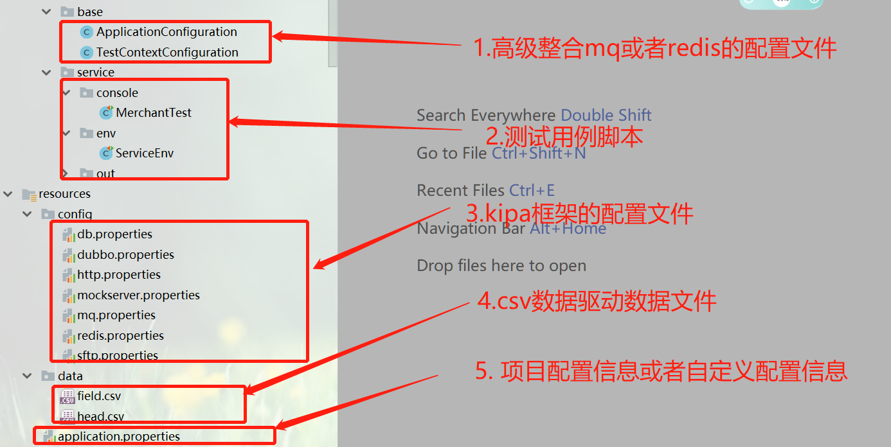

整个的配置情况如下图：

### 配置文件详解

（1）数据库配置：db.properties

```properties
# 数据库驱动
mybatis.datasource.driver=com.mysql.cj.jdbc.Driver
# 数据库url
mybatis.datasource.url=jdbc:mysql://localhost:3306/test?useUnicode=true&characterEncoding=UTF-8&allowMultiQueries=true&useSSL=false&useUnicode=true&useJDBCCompliantTimezoneShift=true&useLegacyDatetimeCode=false&serverTimezone=UTC
# 用户名
mybatis.datasource.username=root
# 密码
mybatis.datasource.password=123456
```

（2）http配置：http.properties

```properties
#http client的配置
# 安全证书校验开关
okhttp.client.verifySSLCertificate=false
# 安全证书本地路径 绝对路径
okhttp.client.certificatePath=D:\\WebProject\\test-service\\src\\main\\java\\com
# 安全证书秘钥路径
okhttp.client.keyStorePath=D:\\WebProject\\test-service\\src\\main\\java\\com
# 安全秘钥
okhttp.client.keyStorePass=781974194
# http连接池最大IDLE连接数
okhttp.client.maxIdleConnections=30
# http 连接时长
okhttp.client.keepAliveDuration=10
```

（3）dubbo的配置：dubbo.properties

```properties
#注册中心的配置
#地址包括：host和port两部分
#zk
dubbo.consumer.register.protocol=zookeeper
#集群模式：10.20.153.10:2181,10.20.153.11:2181,10.20.153.12:2181
dubbo.consumer.register.address=127.0.0.1:2181
#dubbo.consumer.register.group=test
dubbo.consumer.register.timeout=60
#redis 配置
#dubbo.consumer.register.protocol=redis
# redis集群地址
#dubbo.consumer.register.address=10.20.153.10:6379,10.20.153.11:6379,10.20.153.12:6379
#dubbo.consumer.register.group=test
#dubbo.consumer.register.timeout=60
```

（4）mock的配置：mockserver.properties

```properties
# mock远程host
mock.server.remote.host=192.168.31.22
#mock远程端口
mock.server.remote.port=3456
```

（5）redis的配置：redis.properties

```properties
#redis
#redis cluster（集群）地址
spring.redis.cluster.address=192.168.3.21:36379,192.168.3.22:36379,192.168.3.23:36379
# redis 集群密码
spring.redis.cluster.password=123456

# redis单机地址
spring.redis.standalone.address=192.168.3.22:98613
#redis 单机密码
spring.redis.standalone.password=123456
```

（6）sftp的配置：sftp.properties

```properties
#sftp
# sftp服务器host
sftp.connection.host=192.168.31.22
# sftp服务器端口号
sftp.connection.port=3456
# sftp服务器用户名
sftp.connection.username=root
# sftp服务器密码
sftp.connection.password=root
```

（7）mq的配置

```properties
###producer
#该应用是否启用生产者
rocketmq.producer.isOnOff=on
#发送同一类消息的设置为同一个group，保证唯一,默认不需要设置，rocketmq会使用ip@pid(pid代表jvm名字)作为唯一标示
rocketmq.producer.groupName=kipa-consumer
#mq的nameserver地址
rocketmq.producer.nameServerAddress=127.0.0.1:9876
#消息最大长度 默认1024*4(4M)
rocketmq.producer.maxMessageSize=4096
#发送消息超时时间,默认3000
rocketmq.producer.sendMsgTimeout=3000
#发送消息失败重试次数，默认2
rocketmq.producer.retryTimesWhenSendFailed=3
# 扫描该路径下面所有类型的@produce注解，并获取对应的信息

###consumer
##该应用是否启用消费者
#rocketmq.consumer.isOnOff=on
#rocketmq.consumer.groupName=kipa-producer
##mq的nameserver地址
#rocketmq.consumer.namesrvAddr=127.0.0.1:9876
#该消费者订阅的主题和tags("*"号表示订阅该主题下所有的tags),格式：topic~tag1||tag2||tag3;topic2~*;
rocketmq.consumer.consumeThreadMin=20
rocketmq.consumer.consumeThreadMax=64
#设置一次消费消息的条数，默认为1条
rocketmq.consumer.consumeMessageBatchMaxSize=1
```

整个的配置情况如下图：

