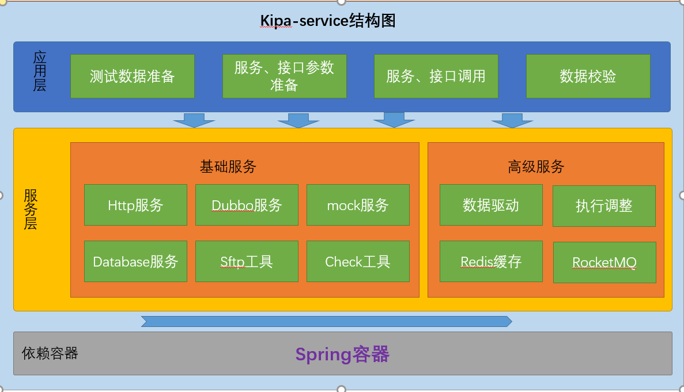

> > 代码的目录结构
> >
> > ```
> > ├─java
> > │  └─com
> > │      └─kipa
> > │          ├─base
> > │          ├─check
> > │          ├─config
> > │          ├─data
> > │          ├─dubbo
> > │          │  ├─annotation
> > │          │  ├─entity
> > │          │  ├─enums
> > │          │  ├─exception
> > │          │  └─service
> > │          │      ├─base
> > │          │      ├─execute
> > │          │      └─impl
> > │          ├─env
> > │          ├─http
> > │          │  ├─annotation
> > │          │  ├─core
> > │          │  ├─emuns
> > │          │  ├─exception
> > │          │  ├─service
> > │          │  │  ├─base
> > │          │  │  ├─convert
> > │          │  │  ├─execute
> > │          │  │  └─impl
> > │          │  └─ssl
> > │          ├─log
> > │          ├─mock
> > │          │  ├─annotation
> > │          │  ├─entity
> > │          │  └─service
> > │          │      ├─base
> > │          │      ├─bo
> > │          │      ├─execute
> > │          │      └─impl
> > │          ├─mq
> > │          │  ├─consumer
> > │          │  └─producer
> > │          ├─mybatis
> > │          │  ├─mapper
> > │          │  ├─provider
> > │          │  ├─service
> > │          │  │  └─impl
> > │          │  └─type
> > │          ├─sftp
> > │          └─utils
> > └─resources --框架配置数据文件
> >     ├─db
> >     ├─dubbo
> >     ├─http
> >     ├─mock
> >     ├─mq
> >     └─redis
> > ```
> >
> > * base：整个项目的配置类，包括和testng整合的测试的基类，用于测试用例的继承和加载testng的测试框架
> > * check：实体类的校验工具类以及用到的常量
> > * config：spring整合http、dubbo、mockserver、mybatis、redis、rocketMq的配置类，包括可控的配置开启注解
> > * data：testng框架数据驱动和数据csv文件解析的工具类
> > * dubbo：整合dubbo框架，远程调用提供dubbo consumer的调用客户端
> > * env：环境切换的信息以及注解
> > * http ：整合http框架，进行get、post、put、delete等操作
> > * log：系统日志注解
> > * mock：mock http请求的框架
> > * mq：rocketMq的整合，提供消息的生产者和消费者操作入口
> > * redis：整合spring data redis，用于redis缓存基本操作
> > * mybatis ：整合mybatis框架，用于数据库的增删改查操作
> > * sftp ：整合jsch框架，提供sftp的文件的远程操作
> > * utils：包括各种工具类

> > 代码封装的底层的第三方工具
> >
> > * http 封装的 okhttp
> > * dubbo 利用apache dubbo的泛化调用技术实现的封装，不依赖任何的api代码
> > * mybatis 利用mybatis 的provider实现动态sql
> > * mock 利用mockserver，绑定特定接口进行http请求的mock
> > * sftp 利用jsch和common-pool2实现基于对象池的jsch连接
> > * redis 直接spring 整合redis，有单机和集群两种配置
> > * mq 直接整合rocketMq

### 框架的结构图
